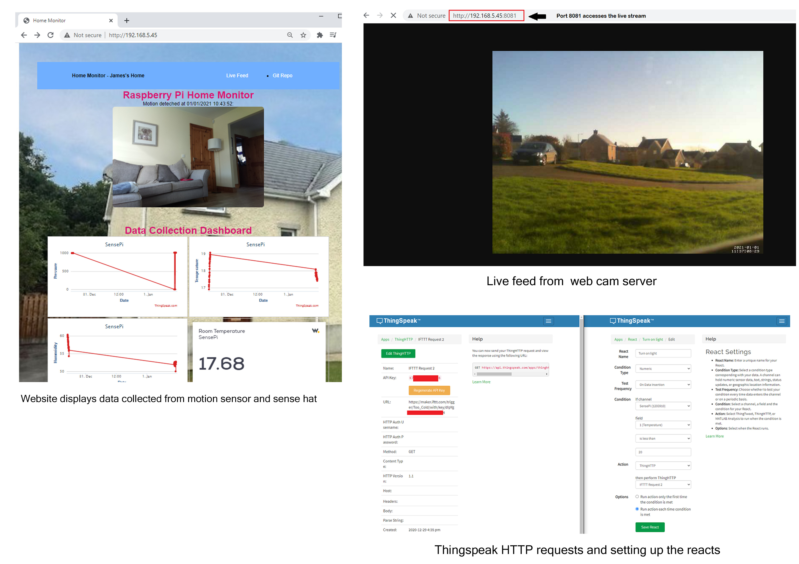

## Read Me
James Geraghty 20022946 - Computer Systems Assignment 2

---

> **Description**
---
This is a home monitoring system that allows the user to track various data metrics across a number of IoT platforms. A Raspberry PI model 3B is powering all the programs. Using a number of API's to make the prorgamme work, this systems allows the user to monitor and keep track of their home from anywhere in the world.

This information is then used to trigger some smart home device.  The data can be viewed in one place through a HTML page. This page is hosted on a web server that was setup on the Raspberry Pi.  There are a total of three programmes running at once. The first program detects motion using a PIR motion sensor attached to a camera. When motion is detected it triggers a webhook that is linked to a smart home bulb, at the same time an image is capture using the raspberry Pi Camera and sent the Firebase database.

The second programme is recording room data. Room humidity, pressure and temperature are being recorded and displayed on a graph that is viewed on the webpage. When the tempErature dips below 20 degrees a second webhook triggers a smart plug that is connected to a raditor in the room. 

The third program displays the temperature of the room. This is recorded every 15 minutes and is displayed on a widget. The temperature data is recorded in JSON format and be stored and queried using MongoDB.

A live web cam server is also connected to the Raspberry Pi, they allows the user to see a live video picture from the outside of the house. 

&nbsp;

>**Programming Languages Used**
---
- Python - Due to its user friendly data structures and the extensive support libraries available, Python is primarily used to write the programs for this project. 

- JavaScript - When building the cross platform app between Firebase and Glitch, 

- HTML and CSS - are used to design the website that displays the information collected from the Raspberry PI.

&nbsp;

>**Physical Devices**
---
- Raspberry Pi Model 3

- Raspberry Pi Camera

- Sense Hat Black Hat Hack3r

- PIR Motion Sensor

- Micro Soft Webcam

&nbsp;

> **IOT Platforms Used**
---
Thingspeak -  is used to handle the data collected from the sense hat. Temperature, humidity and pressure data is collected and this data is then displayed on a HTML page in a graph. There are  number of 'Reacts' created in Thingspeak

The WIA platform is used to display data collected from the Raspberry Pi and sense hat. A widget is displays the data, this is then published on the HTML page. The data collected is saved in json file. This is then downloaded and import to a MongoDB, various queries can be used to get make a more details analysis of the  data collected. A HTTP request triggers 

IFTTT is used to create webhooks that allows the data collected from the Raspberry Pi to trigger various smart home devices. When the temperature in the room goes below 25 degrees, this causes the smart plug that is connected to a radiator to turn on. An email is also sent to the user to notify the user. 
When is motion is detected by the PIR motion sensor, the smart build is triggered. 

&nbsp;

>**Data Storage**
---
- FireBase is used to store the images saved from the motion sensor program. This broker topology to publish the event data to Firebase.  
