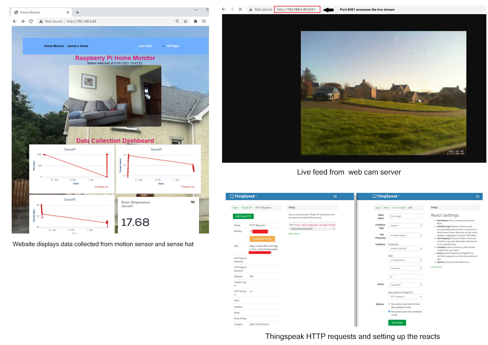

## Read Me
James Geraghty 20022946 - Enterprsie Web Developement 2

---

> **Description**
---
This is a home monitoring system that allows the user to track various data metrics across a number of IoT platforms. A Raspberry PI model 3B is powering all the programs. Using a number of APIs to make the program work, this system allows the user to monitor and keep track of their home from anywhere in the world.

This information is then used to trigger some smart home device. The data can be viewed in one place through a HTML page. This page is hosted on a web server that was set up on the Raspberry Pi. There are a total of three programs running at once. The first program detects motion using a PIR motion sensor attached to a camera. When motion is detected it triggers a webhook that is linked to a smart home bulb, at the same time an image is capture using the raspberry Pi Camera and sent to the Firebase database.

The second program is recording room data. Room humidity, pressure, and temperature are being recorded and displayed on a graph that is viewed on the webpage. When the temperature dips below 20 degrees a second webhook trigger a smart plug that is connected to a radiator in the room.

The third program displays the temperature of the room. This is recorded every 15 minutes and is displayed on a widget. The temperature data is recorded in JSON format and be stored and queried using MongoDB.

A live webcam server is also connected to the Raspberry Pi, they allow the user to see a live video picture from the outside of the house.

&nbsp;

>**Programming Languages Used**
---
- Python - Due to its user-friendly data structures and the extensive support libraries available, Python is primarily used to write the programs for this project. 

- JavaScript - When building the cross platform app between Firebase and Glitch, JavaScript  was used to implement the link between the data and the web application. WIA MQTT API collects temperature data from through the sense hat. 

- HTML and CSS - are used to design the website that displays the information collected from the Raspberry PI.

&nbsp;

>**Physical Devices**
---
- Raspberry Pi Model 3

- Raspberry Pi Camera

- Sense Hat Black Hat Hack3r

- PIR Motion Sensor

- Micro Soft Webcam

  

&nbsp;

